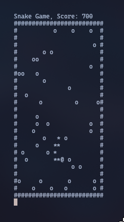

# Snake Game in Rust

## Overview
This is a simple implementation of the classic Snake game built using the Rust programming language. The game is played in a console environment, where the player navigates a snake that grows in size by collecting food while avoiding collisions with itself, borders, or obstacles.

## Features
- Classic snake gameplay mechanics.
- Randomly spawning food that the snake must consume to grow.
- Collision detection with borders and itself to trigger game over.
- Simple and clean terminal-based interface.

## How to Play
1. Clone the repository.
2. Build the project using `cargo build --release`.
3. Run the game with `cargo run --release`.
4. Use the arrow keys (`WASD`) to move the snake.
5. Collect the food (`'o'`) to grow your snake.
6. Avoid collisions to stay alive.
7. Press 'Q' to quit the game.

## Dependencies
- `rand` for random food generation.
- `k_board` crate for keyboard input handling.

## License
This project is licensed under the [MIT License](LICENSE).
